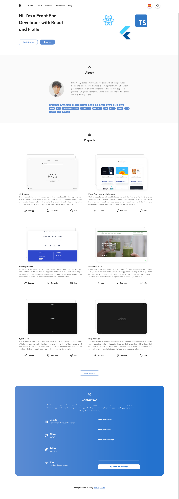

# Portfolio | Harvey
## Development 
### Project structure
### My experience developing
### Technologies used in the project

1. [React](https://es.reactjs.org/) + [Typescript](https://www.typescriptlang.org/)
1. [styled-components](https://styled-components.com/)
1. [localforage](https://www.npmjs.com/package/localforage)
1. [react-syntax-highlighter](https://www.npmjs.com/package/react-syntax-highlighter)
1. [react-tooltip](https://www.npmjs.com/package/react-tooltip)
1. [react-use-scrollspy](https://www.npmjs.com/package/react-use-scrollspy)
1. [Vite](https://vitejs.dev/)

## Demo 

💻 You can copy the link and paste it in your browser: https://portfolio-harvey.netlify.app/

🔗 I was also able to open the website by [clicking here.](https://portfolio-harvey.netlify.app/)

### Screenshots

## Author

- Harvey Yerik

    - [Twitter](https://twitter.com/yerikhar)
    - [GitHub](https://github.com/YerikAH)
    - [Send Me A Message](https://yerikah.github.io/send-me-a-message/dist/)
