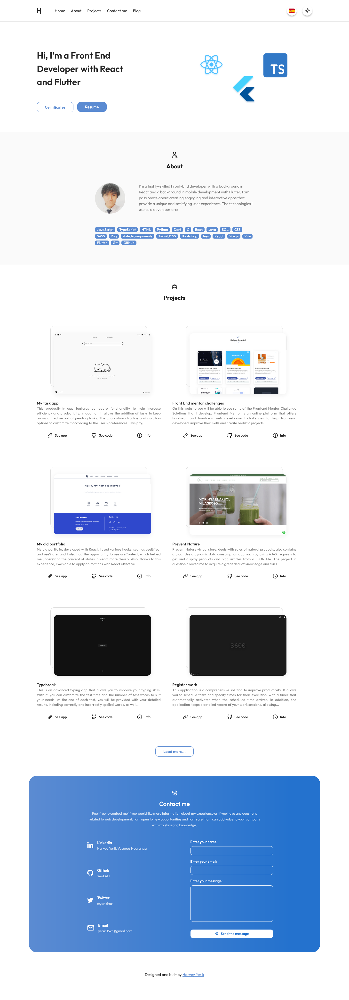

# Portfolio | Harvey
## Development 
### Project structure
### My experience developing
I think this was the project that took me the longest, I used a lot of libraries and learned a lot of things. I reuse some components that I already had from other projects which helped me a lot in the development process (customHook, DataContext), This project helped me a lot when creating interfaces, creating helpers, on the other hand what was a bit confusing for me was the project structure since at first I thought it would not be a lot of work, and I would develop it in a simple way, but after a lot of development, I didn't know what project structure to handle, but I think  looks good. By the way, in the development of this project I learned a little more about the configuration of TypeScript, ESLint, and Prettier, to handle the code in a slightly cleaner way.
### Technologies used in the project

1. [React](https://es.reactjs.org/) + [Typescript](https://www.typescriptlang.org/)
1. [styled-components](https://styled-components.com/)
1. [localforage](https://www.npmjs.com/package/localforage)
1. [react-syntax-highlighter](https://www.npmjs.com/package/react-syntax-highlighter)
1. [react-tooltip](https://www.npmjs.com/package/react-tooltip)
1. [react-use-scrollspy](https://www.npmjs.com/package/react-use-scrollspy)
1. [Vite](https://vitejs.dev/)

## Demo 

💻 You can copy the link and paste it in your browser: https://portfolio-harvey.netlify.app/

🔗 I was also able to open the website by [clicking here.](https://portfolio-harvey.netlify.app/)

### Screenshots

## Author

- Harvey Yerik

    - [Twitter](https://twitter.com/yerikhar)
    - [GitHub](https://github.com/YerikAH)
    - [Send Me A Message](https://yerikah.github.io/send-me-a-message/dist/)
